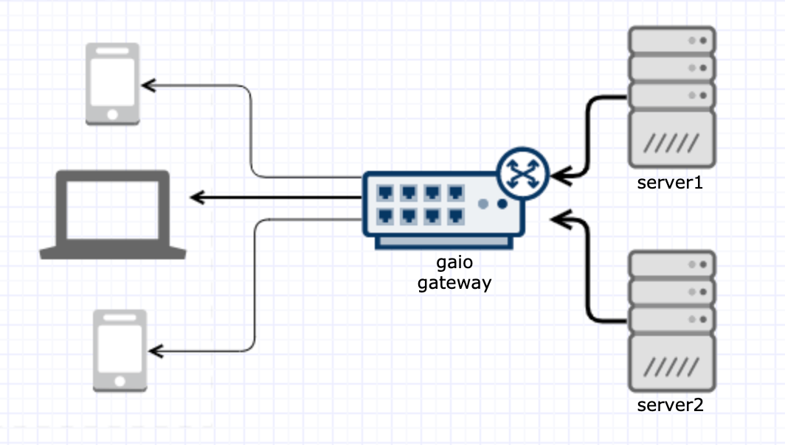

# gaio

[![GoDoc][1]][2] [![MIT licensed][3]][4] [![Build Status][5]][6] [![Go Report Card][7]][8] [![Coverage Statusd][9]][10]

[1]: https://godoc.org/github.com/xtaci/gaio?status.svg
[2]: https://pkg.go.dev/github.com/xtaci/gaio
[3]: https://img.shields.io/badge/license-MIT-blue.svg
[4]: LICENSE
[5]: https://travis-ci.org/xtaci/gaio.svg?branch=master
[6]: https://travis-ci.org/xtaci/gaio
[7]: https://goreportcard.com/badge/github.com/xtaci/gaio
[8]: https://goreportcard.com/report/github.com/xtaci/gaio
[9]: https://codecov.io/gh/xtaci/gaio/branch/master/graph/badge.svg
[10]: https://codecov.io/gh/xtaci/gaio

 

## Introduction
[中文介绍](https://zhuanlan.zhihu.com/p/102890337)

For a typical golang network program, you would first `conn := lis.Accept()` to get a connection and `go func(net.Conn)` to start a goroutine for handling the incoming data, then you would `buf:=make([]byte, 4096)` to allocate some buffer and finally waits on `conn.Read(buf)`.

For a server holding >10K connections with frequent short messages(e.g. < 512B), cost for **context switching** is much more expensive than receiving message(a context switch needs at least 1000 CPU cycles or 600ns on 2.1GHz).

And by eliminating **one goroutine per one connection scheme** with **Edge-Triggered IO Multiplexing**, the 2KB(R)+2KB(W) per connection goroutine stack can be saved. By using internal swap buffer, `buf:=make([]byte, 4096)` can be saved(at the cost of performance).

```gaio``` is an [proactor pattern](https://en.wikipedia.org/wiki/Proactor_pattern) networking library satisfy both **memory constraints** and **performance goals**.


## Features

1. Designed for **>C10K** concurrent connections, **maximized parallelism**, and nice single connection throughput. 
2. [Read(ctx, conn, buffer)](https://godoc.org/github.com/xtaci/gaio#Watcher.Read) can be called with `nil` buffer to make use of **internal swap buffer**.
3. **Non-intrusive** design, this library works with [net.Listener](https://golang.org/pkg/net/#Listener) and [net.Conn](https://golang.org/pkg/net/#Conn). (with [syscall.RawConn](https://golang.org/pkg/syscall/#RawConn) support), **easy to be integrated** into your existing software.
4. **Amortized context switching cost** for tiny messages, able to handle frequent chat message exchanging.
5. Application can decide **when to delegate** [net.Conn](https://golang.org/pkg/net/#Conn) to `gaio`, for example, you can delegate [net.Conn](https://golang.org/pkg/net/#Conn) to `gaio` after some handshaking procedure, or having some [net.TCPConn](https://golang.org/pkg/net/#TCPConn) settings done.
6. Application can decide **when to submit** read or write requests, per-connection [back-pressure](https://en.wikipedia.org/wiki/Transmission_Control_Protocol#Flow_control) can be propagated to peer to slow down sending. This features is particular useful to transmit data from A to B via gaio, which B is slower than A.
7. Tiny, around 1000 LOC, easy to debug.
8. Support for Linux, BSD.

## Conventions

1. Once you submit an async read/write requests with related [net.Conn](https://golang.org/pkg/net/#Conn) to [gaio.Watcher](https://godoc.org/github.com/xtaci/gaio#Watcher), this conn will be delegated to `gaio.Watcher` at first submit. Future use of this conn like [conn.Read](https://golang.org/pkg/net/#TCPConn.Read) or [conn.Write](https://golang.org/pkg/net/#TCPConn.Write) **will return error**, but TCP properties set by `SetReadBuffer()`, `SetWriteBuffer()`, `SetLinger()`, `SetKeepAlive()`, `SetNoDelay()` will be inherited.
2. If you decide not to use this connection anymore, you could call [Watcher.Free(net.Conn)](https://godoc.org/github.com/xtaci/gaio#Watcher.Free) to close socket and free related resources immediately.
3. If you forget to call [Watcher.Free(net.Conn)](https://godoc.org/github.com/xtaci/gaio#Watcher.Free),  runtime garbage collector will cleanup related system resources if nowhere in the system holds the [net.Conn](https://golang.org/pkg/net/#Conn).
4. If you forget to call [Watcher.Close()](https://godoc.org/github.com/xtaci/gaio#Watcher.Close),  runtime garbage collector will cleanup **ALL** related system resources if nowhere in the system holds this `Watcher`.
5. For connection *Load-Balance*, you can create **multiple** [gaio.Watcher](https://godoc.org/github.com/xtaci/gaio#Watcher) with your own strategy to distribute [net.Conn](https://golang.org/pkg/net/#Conn).
6. For acceptor *Load-Balance*, you can use [go-reuseport](https://github.com/libp2p/go-reuseport) as the listener.
7. For read requests submitted with 'nil' buffer, the returning `[]byte` from `Watcher.WaitIO()` is **SAFE** to use **before next call** to [Watcher.WaitIO()](https://godoc.org/github.com/xtaci/gaio#Watcher.WaitIO) returned.

## TL;DR

```go
package main

import (
        "log"
        "net"

        "github.com/xtaci/gaio"
)

// this goroutine will wait for all io events, and sents back everything it received
// in async way
func echoServer(w *gaio.Watcher) {
        for {
                // loop wait for any IO events
                results, err := w.WaitIO()
                if err != nil {
                        log.Println(err)
                        return
                }

                for _, res := range results {
                        switch res.Operation {
                        case gaio.OpRead: // read completion event
                                if res.Error == nil {
                                        // send back everything, we won't start to read again until write completes.
                                        // submit an async write request
                                        w.Write(nil, res.Conn, res.Buffer[:res.Size])
                                }
                        case gaio.OpWrite: // write completion event
                                if res.Error == nil {
                                        // since write has completed, let's start read on this conn again
                                        w.Read(nil, res.Conn, res.Buffer[:cap(res.Buffer)])
                                }
                        }
                }
        }
}

func main() {
        w, err := gaio.NewWatcher()
        if err != nil {
              log.Fatal(err)
        }
        defer w.Close()
	
        go echoServer(w)

        ln, err := net.Listen("tcp", "localhost:0")
        if err != nil {
                log.Fatal(err)
        }
        log.Println("echo server listening on", ln.Addr())

        for {
                conn, err := ln.Accept()
                if err != nil {
                        log.Println(err)
                        return
                }
                log.Println("new client", conn.RemoteAddr())

                // submit the first async read IO request
                err = w.Read(nil, conn, make([]byte, 128))
                if err != nil {
                        log.Println(err)
                        return
                }
        }
}

```

### More examples

<details>
	<summary> Push server </summary>
        package main

```go
package main

import (
        "fmt"
        "log"
        "net"
        "time"

        "github.com/xtaci/gaio"
)

func main() {
        // by simply replace net.Listen with reuseport.Listen, everything is the same as in push-server
        // ln, err := reuseport.Listen("tcp", "localhost:0")
        ln, err := net.Listen("tcp", "localhost:0")
        if err != nil {
                log.Fatal(err)
        }

        log.Println("pushing server listening on", ln.Addr(), ", use telnet to receive push")

        // create a watcher
        w, err := gaio.NewWatcher()
        if err != nil {
                log.Fatal(err)
        }

        // channel
        ticker := time.NewTicker(time.Second)
        chConn := make(chan net.Conn)
        chIO := make(chan gaio.OpResult)

        // watcher.WaitIO goroutine
        go func() {
                for {
                        results, err := w.WaitIO()
                        if err != nil {
                                log.Println(err)
                                return
                        }

                        for _, res := range results {
                                chIO <- res
                        }
                }
        }()

        // main logic loop, like your program core loop.
        go func() {
                var conns []net.Conn
                for {
                        select {
                        case res := <-chIO: // receive IO events from watcher
                                if res.Error != nil {
                                        continue
                                }
                                conns = append(conns, res.Conn)
                        case t := <-ticker.C: // receive ticker events
                                push := []byte(fmt.Sprintf("%s\n", t))
                                // all conn will receive the same 'push' content
                                for _, conn := range conns {
                                        w.Write(nil, conn, push)
                                }
                                conns = nil
                        case conn := <-chConn: // receive new connection events
                                conns = append(conns, conn)
                        }
                }
        }()

        // this loop keeps on accepting connections and send to main loop
        for {
                conn, err := ln.Accept()
                if err != nil {
                        log.Println(err)
                        return
                }
                chConn <- conn
        }
}

```
</details>

## Documentation

For complete documentation, see the associated [Godoc](https://godoc.org/github.com/xtaci/gaio).

## Benchmarks

| Test Case | Throughput test with 64KB buffer |
|:-------------:|-----------------------------------------------------------------------------------------------------------------------------------------------------------------------------------------------------------------|
| Description | A client keep on sending 64KB bytes to server, server keeps on reading and sending back whatever it received, the client keeps on receiving whatever the server sent back until all bytes received successfully |
| Command | `go test -v -run=^$ -bench Echo` |
| Macbook Pro | 1695.27 MB/s 518 B/op 4 allocs/op|
| Linux AMD64 | 1883.23 MB/s 518 B/op 4 allocs/op|
| Raspberry Pi4 | 354.59 MB/s 334 B/op 4 allocs/op|

| Test Case | 8K concurrent connection echo test |
|:-------------:|-----------------------------------------------------------------------------------------------------------------------------------------------------------------------------------------------------------------|
|Description| Start 8192 clients, each client send 1KB data to server, server keeps on reading and sending back whatever it received, the client keeps on receiving whatever the server sent back until all bytes received successfully.|
| Command | `go test -v -run=8k` |
| Macbook Pro | 1.09s |
| Linux AMD64 | 0.94s |
| Raspberry Pi4 | 2.09s |

### Regression


X -> number of concurrent connections, Y -> time of completion in seconds

```
Best-fit values	 
Slope	8.613e-005 ± 5.272e-006
Y-intercept	0.08278 ± 0.03998
X-intercept	-961.1
1/Slope	11610
 
95% Confidence Intervals	 
Slope	7.150e-005 to 0.0001008
Y-intercept	-0.02820 to 0.1938
X-intercept	-2642 to 287.1
 
Goodness of Fit	 
R square	0.9852
Sy.x	0.05421
 
Is slope significantly non-zero?	 
F	266.9
DFn,DFd	1,4
P Value	< 0.0001
Deviation from horizontal?	Significant
 
Data	 
Number of XY pairs	6
Equation	Y = 8.613e-005*X + 0.08278
```


## License

`gaio` source code is available under the MIT [License](/LICENSE).

## References

* https://zhuanlan.zhihu.com/p/102890337 -- gaio小记
* https://github.com/golang/go/issues/15735 -- net: add mechanism to wait for readability on a TCPConn
* https://en.wikipedia.org/wiki/C10k_problem -- C10K
* https://golang.org/src/runtime/netpoll_epoll.go -- epoll in golang 
* https://www.freebsd.org/cgi/man.cgi?query=kqueue&sektion=2 -- kqueue
* https://idea.popcount.org/2017-02-20-epoll-is-fundamentally-broken-12/ -- epoll is fundamentally broken
* https://en.wikipedia.org/wiki/Transmission_Control_Protocol#Flow_control -- TCP Flow Control 
* http://www.idc-online.com/technical_references/pdfs/data_communications/Congestion_Control.pdf -- Back-pressure

## Status

Stable
