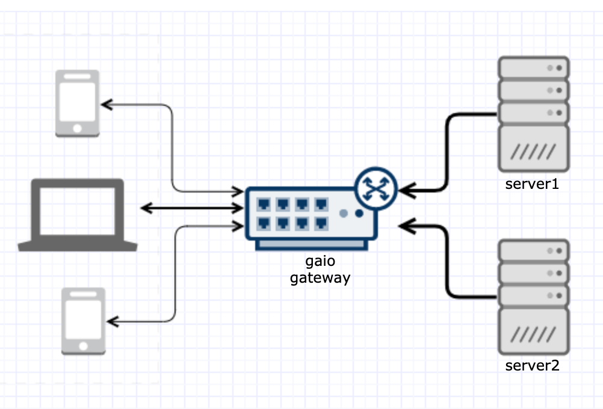
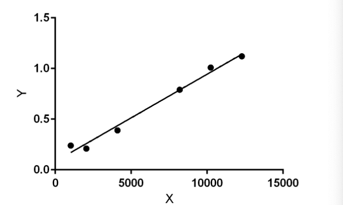

# gaio

[![GoDoc][1]][2] [![MIT licensed][3]][4] [![Build Status][5]][6] [![Go Report Card][7]][8] [![Coverage Statusd][9]][10]

[1]: https://godoc.org/github.com/xtaci/gaio?status.svg
[2]: https://pkg.go.dev/github.com/xtaci/gaio
[3]: https://img.shields.io/badge/license-MIT-blue.svg
[4]: LICENSE
[5]: https://img.shields.io/github/created-at/xtaci/gaio
[6]: https://img.shields.io/github/created-at/xtaci/gaio
[7]: https://goreportcard.com/badge/github.com/xtaci/gaio
[8]: https://goreportcard.com/report/github.com/xtaci/gaio
[9]: https://codecov.io/gh/xtaci/gaio/branch/master/graph/badge.svg
[10]: https://codecov.io/gh/xtaci/gaio

 

## Introduction
[中文介绍](https://zhuanlan.zhihu.com/p/102890337)

In a typical Go network program, you start by accepting a connection with `conn := lis.Accept()`, then initiate a goroutine to handle incoming data using `go func(net.Conn)`. Next, you allocate a buffer with `buf := make([]byte, 4096)` and wait for data with `conn.Read(buf)`.

For a server managing over 10,000 connections with frequent short messages (e.g., <512 bytes), the cost of context switching becomes significantly higher than that of receiving messages—each context switch can require over 1,000 CPU cycles or around 600 ns on a 2.1 GHz processor.

By eliminating one goroutine per connection through Edge-Triggered I/O Multiplexing, you can save the 2KB (R) + 2KB (W) stack space typically used per goroutine. Additionally, by employing an internal swap buffer, you can avoid the need for `buf := make([]byte, 4096)` at the expense of some performance.

The gaio library implements the proactor pattern, effectively addressing both memory constraints and performance objectives.

## Features

- **High Performance:** Tested in High Frequency Trading environments, handling 30K–40K RPS on a single HVM server.
- **Scalability:** Designed for over C10K concurrent connections, optimizing both parallelism and single connection throughput.
- **Flexible Buffering:** Use `Read(ctx, conn, buffer)` with a nil buffer to leverage the internal swap buffer.
- **Non-Intrusive Integration:** Compatible with `net.Listener` and `net.Conn` (supports `syscall.RawConn`), allowing easy integration into existing applications.
- **Efficient Context Switching:** Minimizes context switching costs for small messages, ideal for frequent chat message exchanges.
- **Customizable Delegation:** Applications can choose when to delegate `net.Conn` to gaio, such as after a handshake or specific `net.TCPConn` settings.
- **Back-Pressure Handling:** Applications can control when to submit read or write requests, enabling per-connection back-pressure to slow down sending when necessary, particularly useful for transferring data from a faster source (A) to a slower destination (B).
- **Lightweight and Maintainable:** Approximately 1,000 lines of code, making it easy to debug.
- **Cross-Platform Support:** Compatible with Linux and BSD.

## Conventions

- **Connection Delegation:** Once you submit an async read/write request with a related `net.Conn` to `gaio.Watcher`, that connection is delegated to the watcher. Subsequent calls to `conn.Read` or `conn.Write` will return an error, but TCP properties set by `SetReadBuffer()`, `SetWriteBuffer()`, `SetLinger()`, `SetKeepAlive()`, and `SetNoDelay()` will be retained.
  
- **Resource Management:** If you no longer need a connection, call `Watcher.Free(net.Conn)` to immediately close the socket and free resources. If you forget to call `Watcher.Free`, the runtime garbage collector will clean up system resources if `net.Conn` is not referenced elsewhere. Failing to call `Watcher.Close()` will lead the garbage collector to clean up all related resources if the watcher is unreferenced.

- **Load Balancing:** For connection load balancing, create multiple `gaio.Watcher` instances to distribute `net.Conn` using your preferred strategy. For acceptor load balancing, utilize `go-reuseport` as the listener.

- **Safe Read Requests:** When submitting read requests with a 'nil' buffer, the returned `[]byte` from `Watcher.WaitIO()` is safe to use until the next call to `Watcher.WaitIO()`.

## TL;DR

```go
package main

import (
        "log"
        "net"

        "github.com/xtaci/gaio"
)

// this goroutine will wait for all io events, and sents back everything it received
// in async way
func echoServer(w *gaio.Watcher) {
        for {
                // loop wait for any IO events
                results, err := w.WaitIO()
                if err != nil {
                        log.Println(err)
                        return
                }

                for _, res := range results {
                        switch res.Operation {
                        case gaio.OpRead: // read completion event
                                if res.Error == nil {
                                        // send back everything, we won't start to read again until write completes.
                                        // submit an async write request
                                        w.Write(nil, res.Conn, res.Buffer[:res.Size])
                                }
                        case gaio.OpWrite: // write completion event
                                if res.Error == nil {
                                        // since write has completed, let's start read on this conn again
                                        w.Read(nil, res.Conn, res.Buffer[:cap(res.Buffer)])
                                }
                        }
                }
        }
}

func main() {
        w, err := gaio.NewWatcher()
        if err != nil {
              log.Fatal(err)
        }
        defer w.Close()
	
        go echoServer(w)

        ln, err := net.Listen("tcp", "localhost:0")
        if err != nil {
                log.Fatal(err)
        }
        log.Println("echo server listening on", ln.Addr())

        for {
                conn, err := ln.Accept()
                if err != nil {
                        log.Println(err)
                        return
                }
                log.Println("new client", conn.RemoteAddr())

                // submit the first async read IO request
                err = w.Read(nil, conn, make([]byte, 128))
                if err != nil {
                        log.Println(err)
                        return
                }
        }
}

```

### More examples

<details>
	<summary> Push server </summary>
        package main

```go
package main

import (
        "fmt"
        "log"
        "net"
        "time"

        "github.com/xtaci/gaio"
)

func main() {
        // by simply replace net.Listen with reuseport.Listen, everything is the same as in push-server
        // ln, err := reuseport.Listen("tcp", "localhost:0")
        ln, err := net.Listen("tcp", "localhost:0")
        if err != nil {
                log.Fatal(err)
        }

        log.Println("pushing server listening on", ln.Addr(), ", use telnet to receive push")

        // create a watcher
        w, err := gaio.NewWatcher()
        if err != nil {
                log.Fatal(err)
        }

        // channel
        ticker := time.NewTicker(time.Second)
        chConn := make(chan net.Conn)
        chIO := make(chan gaio.OpResult)

        // watcher.WaitIO goroutine
        go func() {
                for {
                        results, err := w.WaitIO()
                        if err != nil {
                                log.Println(err)
                                return
                        }

                        for _, res := range results {
                                chIO <- res
                        }
                }
        }()

        // main logic loop, like your program core loop.
        go func() {
                var conns []net.Conn
                for {
                        select {
                        case res := <-chIO: // receive IO events from watcher
                                if res.Error != nil {
                                        continue
                                }
                                conns = append(conns, res.Conn)
                        case t := <-ticker.C: // receive ticker events
                                push := []byte(fmt.Sprintf("%s\n", t))
                                // all conn will receive the same 'push' content
                                for _, conn := range conns {
                                        w.Write(nil, conn, push)
                                }
                                conns = nil
                        case conn := <-chConn: // receive new connection events
                                conns = append(conns, conn)
                        }
                }
        }()

        // this loop keeps on accepting connections and send to main loop
        for {
                conn, err := ln.Accept()
                if err != nil {
                        log.Println(err)
                        return
                }
                chConn <- conn
        }
}

```
</details>

## Documentation

For complete documentation, see the associated [Godoc](https://godoc.org/github.com/xtaci/gaio).

## Benchmarks

| Test Case | Throughput test with 64KB buffer |
|:-------------:|-----------------------------------------------------------------------------------------------------------------------------------------------------------------------------------------------------------------|
| Description | A client keep on sending 64KB bytes to server, server keeps on reading and sending back whatever it received, the client keeps on receiving whatever the server sent back until all bytes received successfully |
| Command | `go test -v -run=^$ -bench Echo` |
| Macbook Pro | 1695.27 MB/s 518 B/op 4 allocs/op|
| Linux AMD64 | 1883.23 MB/s 518 B/op 4 allocs/op|
| Raspberry Pi4 | 354.59 MB/s 334 B/op 4 allocs/op|

| Test Case | 8K concurrent connection echo test |
|:-------------:|-----------------------------------------------------------------------------------------------------------------------------------------------------------------------------------------------------------------|
|Description| Start 8192 clients, each client send 1KB data to server, server keeps on reading and sending back whatever it received, the client keeps on receiving whatever the server sent back until all bytes received successfully.|
| Command | `go test -v -run=8k` |
| Macbook Pro | 1.09s |
| Linux AMD64 | 0.94s |
| Raspberry Pi4 | 2.09s |

## Testing Directives
On MacOS, you need to increase the max open files limit to run the benchmarks.

```bash
sysctl -w kern.ipc.somaxconn=4096
sysctl -w kern.maxfiles=100000
sysctl -w kern.maxfilesperproc=100000
sysctl -w net.inet.ip.portrange.first=1024
sysctl -w net.inet.ip.portrange.last=65535

ulimit -S -n 65536
```

### Regression



X -> number of concurrent connections, Y -> time of completion in seconds

```
Best-fit values	 
Slope	8.613e-005 ± 5.272e-006
Y-intercept	0.08278 ± 0.03998
X-intercept	-961.1
1/Slope	11610
 
95% Confidence Intervals	 
Slope	7.150e-005 to 0.0001008
Y-intercept	-0.02820 to 0.1938
X-intercept	-2642 to 287.1
 
Goodness of Fit	 
R square	0.9852
Sy.x	0.05421
 
Is slope significantly non-zero?	 
F	266.9
DFn,DFd	1,4
P Value	< 0.0001
Deviation from horizontal?	Significant
 
Data	 
Number of XY pairs	6
Equation	Y = 8.613e-005*X + 0.08278
```

## FAQ
1. if you encounter something like:

```
# github.com/xtaci/gaio [github.com/xtaci/gaio.test]
./aio_linux.go:155:7: undefined: setAffinity
./watcher.go:588:4: undefined: setAffinity
FAIL	github.com/xtaci/gaio [build failed]
FAIL
```

make sure you have gcc/clang installed.

## License

`gaio` source code is available under the MIT [License](/LICENSE).

## References

* https://zhuanlan.zhihu.com/p/102890337 -- gaio小记
* https://github.com/golang/go/issues/15735 -- net: add mechanism to wait for readability on a TCPConn
* https://en.wikipedia.org/wiki/C10k_problem -- C10K
* https://golang.org/src/runtime/netpoll_epoll.go -- epoll in golang 
* https://www.freebsd.org/cgi/man.cgi?query=kqueue&sektion=2 -- kqueue
* https://idea.popcount.org/2017-02-20-epoll-is-fundamentally-broken-12/ -- epoll is fundamentally broken
* https://en.wikipedia.org/wiki/Transmission_Control_Protocol#Flow_control -- TCP Flow Control 
* http://www.idc-online.com/technical_references/pdfs/data_communications/Congestion_Control.pdf -- Back-pressure

## Status

Stable
